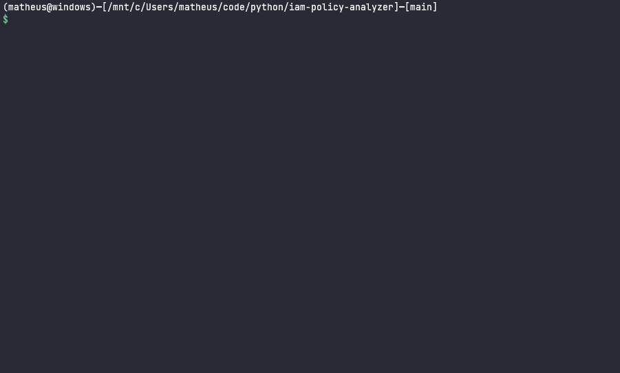

<h1 align="center">IAM-POLICY-ANALYZER</h1>

<p align="center">
    <a href="#about">About</a>&nbsp;&nbsp;&nbsp;|&nbsp;&nbsp;&nbsp;
    <a href="#usage">Usage</a>&nbsp;&nbsp;&nbsp;|&nbsp;&nbsp;&nbsp;
    <a href="#installation">Installation</a>&nbsp;&nbsp;&nbsp;|&nbsp;&nbsp;&nbsp;
    <a href="#contributing">Contributing</a>&nbsp;&nbsp;&nbsp;|&nbsp;&nbsp;&nbsp;
    <a href="#license">License</a>
</p>

<br>

## About
Command line tool to list all AWS IAM entities (users, roles) of one or more AWS accounts based on actions and resources declared in a json file that correspond to the permissions in IAM policies of the identities



<!-- USAGE -->
## Usage
Create a json file in the current directory containing the desired actions and resources

Example file:

```json
{
  "actions": [
    "dynamodb:BatchGetItem",
    "dynamodb:GetItem"
  ],
  "resources": [
    "arn:aws:dynamodb:us-east-1:123456789012:table/my-personal-table"
  ]
}
```

Running the script will result in a report in csv format like this:

account      | arn                                  | name  | actions                                        | resource
------------ | ------------------------------------ | ----- | ---------------------------------------------- | --------
123456789012 | arn:aws:iam::123456789012:role/ADMIN | ADMIN | ['dynamodb:GetItem','dynamodb:BatchGetItem'] | arn:aws:dynamodb:us-east-1:123456789012:table/my-personal-table
123456789012 | arn:aws:iam::123456789012:user/USER  | ADMIN | ['dynamodb:GetItem','dynamodb:BatchGetItem'] | arn:aws:dynamodb:us-east-1:123456789012:table/my-personal-table

<!-- INSTALATION -->
## Installation
#### 1. Install python and pip
```
sudo apt install python3 && python3-pip
```

#### 2. Clone git repository
```
git clone git@github.com:almeida-matheus/iam-policy-analyzer.git
```

#### 3. Execute the script
```
cd iam-policy-analyzer/
python3 main.py
```

<!-- CONTRIBUTING -->
## Contributing
1. Fork the project
2. Create your branch (`git checkout -b branch-name`)
3. Add your changes (`git add .`)
4. Commit your changes (`git commit -m 'add some feature'`)
5. Push to the branch (`git push origin branch-name`)
6. Open a pull request

<!-- LICENSE -->
## License
Distributed under the MIT License. See [LICENSE](LICENSE) for more information.